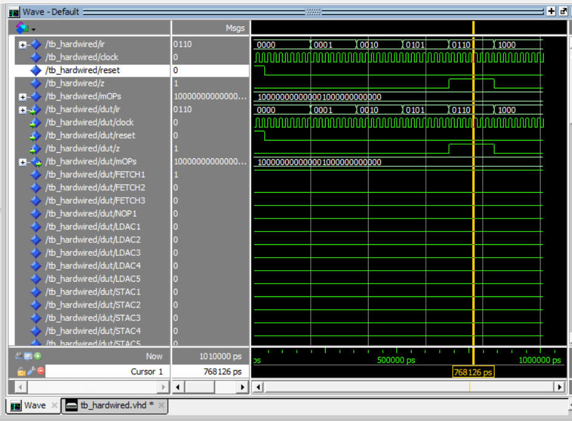

# VHDL Hardwired CPU

A VHDL implementation of a simple CPU featuring an ALU, registers,
a memory interface, a common system bus and a hardwired control unit.

## Project Overview

The purpose of this project is to design and simulate a simple processor
using VHDL.

The processor is divided into a datapath and a hardwired control unit.
The control unit decodes each instruction and generates the required
micro-operation signals during timing states T0–T7.

## Main Components

- Arithmetic Logic Unit
- Hardwired Control Unit
- Instruction Register
- Address Register
- Program Counter
- Data Register
- Temporary Register
- General-Purpose Register
- Accumulator
- Zero Flag
- Memory Interface
- Common System Bus
- Opcode Decoder
- Timing-State Decoder
- 3-bit Timing Counter

## CPU Architecture

The design uses:

- 8-bit data paths
- 16-bit address paths
- 8-bit instruction register
- 4-bit instruction opcode
- Hardwired instruction decoding
- Timing states T0–T7
- Micro-operation control signals

The `cpu.vhd` file connects the processor registers, ALU, memory,
system bus and hardwired control unit.

## Supported Instructions

The current hardwired control unit implements:

| Instruction | Description |
|---|---|
| NOP | No operation |
| LDAC | Load accumulator |
| STAC | Store accumulator |
| MVAC | Move accumulator |
| MOVR | Move register |
| JUMP | Unconditional jump |
| JMPZ | Jump if zero |
| JPNZ | Jump if not zero |
| ADD | Addition |
| SUB | Subtraction |
| INAC | Increment accumulator |
| CLAC | Clear accumulator |
| AND | Bitwise AND |
| OR | Bitwise OR |
| XOR | Bitwise XOR |
| NOT | Bitwise NOT |

## Important Files

| File | Purpose |
|---|---|
| `cpu.vhd` | Top-level CPU datapath |
| `hardwired.vhd` | Hardwired control unit |
| `alu.vhd` | Arithmetic and logic operations |
| `alus_production.vhd` | ALU control-signal generation |
| `buss.vhd` | Common system bus |
| `Memory.vhd` | Memory component |
| `memory1.vhd` | Memory interface |
| `regnbit.vhd` | Generic register |
| `regf.vhd` | Zero-flag register |
| `Counter.vhd` | Timing-state counter |
| `Decoder_4to16.vhd` | Instruction decoder |
| `Decoder_3to8.vhd` | Timing-state decoder |
| `cpulib.vhd` | CPU component declarations |
| `ask4lib.vhd` | Control-unit component declarations |
| `tb_hardwired.vhd` | Hardwired control-unit testbench |

## Instruction Cycle

The instruction cycle begins with three fetch states:

- `T0`: Address setup
- `T1`: Memory read and program-counter update
- `T2`: Instruction-register loading

Execution begins from `T3`. Multi-cycle instructions may continue through
states `T4`–`T7`. When an instruction finishes, the timing counter is
cleared and execution returns to `T0`.

## Simulation

The repository includes a VHDL testbench for the hardwired control unit.

The testbench generates a clock with a period of 20 ns and tests several
instructions, including:

- NOP
- LDAC
- STAC
- JUMP
- JMPZ
- ADD

### Simulation Result

## Tools

The project can be compiled and simulated using tools such as:

- Intel Quartus Prime
- ModelSim

## Basic Simulation Procedure

1. Create a VHDL project.
2. Add the source and package files.
3. Compile the design.
4. Set `tb_hardwired` as the simulation top-level entity.
5. Start the simulation.
6. Run the simulation for approximately 1200 ns.
7. Inspect the opcode, timing-state and micro-operation signals.

## Educational Objectives

This project demonstrates:

- VHDL structural and behavioural modelling
- Processor datapath design
- Hardwired control-unit design
- Instruction decoding
- Register-transfer operations
- Timing-state generation
- ALU control
- Memory and bus interfacing
- Testbench development and waveform analysis

## Author

Developed by [jimvavou](https://github.com/jimvavou) as an FPGA and
computer-architecture project.
